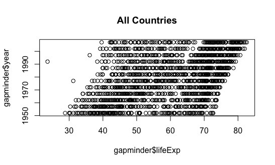

##  Repeating things in R study group lesson
by Tiffany Timbers (with materials borrowed from [Software Carpentry](http://software-carpentry.org/))

Dependencies: R, and gapminder, dplyr & ggplot2 R packages

### Motivation

One major reason for using a scripting language, such as R or Python, for your data 
analysis is that it makes your more efficient - it is easy once you have written code, to 
apply it to a new set of data. But how about 10 new sets of data? In this lesson, we're
going to discuss the useful tools and strategies, that are available in R, that will help
you become more efficient with your data analysis by easily repeating a command or 
analysis on many things (e.g., datasets). 

### Learning Objectives

After this lesson, learners will be to:

1. write a for loop in R to apply a command (e.g., plotting) or analysis (e.g., linear models) to many datasets

2. use dplyr to to apply an analysis (e.g., linear model) to many datasets

3. Explain why, in R, it is more advantageous to use a tool, such as dplyr, as opposed to a for loop

### Dataset

We will be working with the gapminder dataset for this lesson. You can load the dataset 
by calling the gapminder R package:

~~~
library(gapminder)
head(gapminder)
~~~

~~~
Source: local data frame [6 x 6]

      country continent  year lifeExp      pop gdpPercap
       (fctr)    (fctr) (int)   (dbl)    (int)     (dbl)
1 Afghanistan      Asia  1952  28.801  8425333  779.4453
2 Afghanistan      Asia  1957  30.332  9240934  820.8530
3 Afghanistan      Asia  1962  31.997 10267083  853.1007
4 Afghanistan      Asia  1967  34.020 11537966  836.1971
5 Afghanistan      Asia  1972  36.088 13079460  739.9811
6 Afghanistan      Asia  1977  38.438 14880372  786.1134
~~~

So we can see that this dataset is a dataframe that has 6 columns. What countries are in 
this dataset? We can find that out by asking what are the unique values in the country 
column:

~~~
unique(gapminder$country)
~~~

This returns a list of the 142 countries in the dataset.

For this lesson, we will be focusing plotting `year` versus `lifeExp` for different 
countries. Let's plot this for all the countries together:

~~~
plot(x = gapminder$year, y = gapminder$lifeExp, main = "All Countries")
~~~

### For Loops in R

It looks like there may be a positive correlation between `year` and `lifeExp`, but does
the relationship look the same for all countries? Let's look at at three different 
countries to start, for example, Canada, the United States and Zimbabwe.

To plot Canada's data, we need to first subset the data, and then plot it:

~~~
Canada <- gapminder[gapminder$country == "Canada",]
plot(x = Canada$year, y = Canada$lifeExp, main = "Canada")
~~~

OK, let's do the same for the United States and Zimbabwe:

~~~
US <- gapminder[gapminder$country == "United States",]
plot(x = US$year, y = US$lifeExp, main = "US")

Zimbabwe <- gapminder[gapminder$country == "Zimbabwe",]
plot(x = Zimbabwe$year, y = Zimbabwe$lifeExp, main = "Zimbabwe")
~~~

We can see that Canada & the US look fairly similar, but something very different happened
in Zimbabwe. How might we plot this data more efficiently, if we wanted to look at another
3 countries, or all 142?

One way we could do this is to use a for loop. A for loop iterates over a list of things, 
and applies the commands within the loop for each item in the list. Let's start with a 
simple example where we print the name of the countries:

~~~
countries_to_plot <- c("Canada", "United States", "Zimbabwe")

for (country in countries_to_plot) {
  print(country)
}
~~~

We can use a similar strategy to plot many things. Let's start with the 3 we have already
plotted, Canada, the United States and Zimbabwe.

~~~ 
countries_to_plot <- c("Canada", "United States", "Zimbabwe")

for (country in countries_to_plot) {
  country_to_plot <-  gapminder[gapminder$country == country,]
  plot(x = country_to_plot$year, y = country_to_plot$lifeExp, main = country)
}
~~~

Now using the code for this loop, we can easily change which countries to plot, and how 
many, we could even plot all 142 like this:

~~~ 
countries_to_plot <- unique(gapminder$country)

for (country in countries_to_plot) {
  country_to_plot <-  gapminder[gapminder$country == country,]
  plot(x = country_to_plot$year, y = country_to_plot$lifeExp, main = country)
}
~~~

Pretty cool right? A word of caution, although loops can be useful, and this seemed pretty
quick, loops in R generally are not that efficient. Looping over a lot of things can be 
very slow, as is looping over commands that use a lot of memory. What can you do in these
cases? You can use some vectorization approaches, that use a faster strategy, which is 
hidden under the hood of R, and we don't really need to worry about the nuts and bolts,
we can just take advantage of them. The one that we will explore today is the package 
`dplyr`.

### Dplyr for repeating analysis on several datasets

The dplyr package provides a number of very useful functions for manipulating dataframes 
in a way that will reduce repetition, reduce the probability of making errors, and 
probably even save you some typing. As an added bonus, you might even find the dplyr 
grammar easier to read.

There are 6 of the most commonly used functions as well as using pipes (%>%) to combine 
them.

1. select()
2. filter()
3. group_by()
4. summarize()
5. mutate()
6. do()

In this lesson we will focus on `group_by()` and `do()`, as well as pipes (%>%). If you 
want to learn more about the other dplyr functions, a good place to start is 
[this](http://swcarpentry.github.io/r-novice-gapminder/13-dplyr.html) Software Carptentry 
lesson.

The code that we are working towards, which will use `dplyr` to do the same thing as the 
loop above, is written below. We will take some time to explain each part of it.

~~~
my_plots <- group_by(gapminder, country) %>% 
  do(plot(x = .$year, y = .$lifeExp, main = .$country[1]))
~~~

* note - running the above code works, but throws an error afterwards, we will explain the reason for that later, and provide a slightly better way to do this.*

#### Using `group_by()` 

The first command we use is `group_by()`. Using this command will create a grouped 
dataframe (first argument passed to `group_by()`, which is grouped by the unique elements 
in the specified column (second argument passed to `group_by()`). 

Using `str()`, we can see that when we apply `group_by()` to the data frame, that we get a 
change in the data frame structure than we previously had.

~~~
str(gapminder)
~~~

~~~
Classes ‘tbl_df’, ‘tbl’ and 'data.frame':	1704 obs. of  6 variables:
 $ country  : Factor w/ 142 levels "Afghanistan",..: 1 1 1 1 1 1 1 1 1 1 ...
 $ continent: Factor w/ 5 levels "Africa","Americas",..: 3 3 3 3 3 3 3 3 3 3 ...
 $ year     : int  1952 1957 1962 1967 1972 1977 1982 1987 1992 1997 ...
 $ lifeExp  : num  28.8 30.3 32 34 36.1 ...
 $ pop      : int  8425333 9240934 10267083 11537966 13079460 14880372 12881816 13867957 16317921 22227415 ...
 $ gdpPercap: num  779 821 853 836 740 ...
~~~

versus

~~~
str(gapminder %>% group_by(continent))
~~~

~~~
Classes 'grouped_df', 'tbl_df', 'tbl' and 'data.frame': 1704 obs. of  6 variables:
 $ country  : Factor w/ 142 levels "Afghanistan",..: 1 1 1 1 1 1 1 1 1 1 ...
 $ year     : int  1952 1957 1962 1967 1972 1977 1982 1987 1992 1997 ...
 $ pop      : num  8425333 9240934 10267083 11537966 13079460 ...
 $ continent: Factor w/ 5 levels "Africa","Americas",..: 3 3 3 3 3 3 3 3 3 3 ...
 $ lifeExp  : num  28.8 30.3 32 34 36.1 ...
 $ gdpPercap: num  779 821 853 836 740 ...
 - attr(*, "vars")=List of 1
  ..$ : symbol continent
 - attr(*, "drop")= logi TRUE
 - attr(*, "indices")=List of 5
  ..$ : int  24 25 26 27 28 29 30 31 32 33 ...
  ..$ : int  48 49 50 51 52 53 54 55 56 57 ...
  ..$ : int  0 1 2 3 4 5 6 7 8 9 ...
  ..$ : int  12 13 14 15 16 17 18 19 20 21 ...
  ..$ : int  60 61 62 63 64 65 66 67 68 69 ...
 - attr(*, "group_sizes")= int  624 300 396 360 24
 - attr(*, "biggest_group_size")= int 624
 - attr(*, "labels")='data.frame':  5 obs. of  1 variable:
  ..$ continent: Factor w/ 5 levels "Africa","Americas",..: 1 2 3 4 5
  ..- attr(*, "vars")=List of 1
  .. ..$ : symbol continent
  ..- attr(*, "drop")= logi TRUE
~~~

 A grouped_df can be thought of as a list where each item in the listis a data.frame which 
 contains only the rows that correspond to the a particular value continent (at least in 
 the example above). This is illustrated below:
 
 

#### Using `%>%` 

The next new thing we see in our code below is `%>%`:

~~~
my_plots <- group_by(gapminder, country) %>% 
  do(plot(x = .$year, y = .$lifeExp, main = .$country[1]))
~~~

`%>%` is called a pipe. This command sends the output of the previous command to the 
input of the next one. It is very commonly used between different `dplyr` commands. 
 
*Fun Fact: There is a good chance you have encountered pipes before in the shell. In R, a 
pipe symbol is `%>%` while in the shell it is `|` but the concept is the same!* 
   
#### Using `do()`

`do()` is a general purpose complement to the specialised `dplyr` manipulation functions 
(`filter`, `select`, `mutate`, `summarise` and `arrange`). `do()` is used to perform 
arbitrary computation, and returns either a data frame or arbitrary objects which will be 
stored in a list. 

*Fun Fact: This can be very useful when working with multiple models because by combining 
`group_by` & `do()` you can fit models for each group, and then have a data frame or list
that you can later flexibly extract components with either another `do()` or 
`summarise()`.*

More documentation and examples of `do()` can be found 
[here](http://www.inside-r.org/node/230616).

Thus, in the code below, `do()` takes the `gapminder` dataset, which has been grouped by 
country, and applies the plot command to the `year` and `lifeExp` columns for each 
country. The `.` before `$year`, `$lifeExp`, and `$country` references the data frame that
was passed to `do()` via the preceding pipe `%>%`. 

What about the `[1]` after country? Well, there are many records in the column country 
for the grouped data frame, and there are all the same for each country (because we 
grouped by country). We only need the one for each country, so we just need to grab the 
first one.

~~~
my_plots <- group_by(gapminder, country) %>% 
  do(plot(x = .$year, y = .$lifeExp, main = .$country[1]))
~~~

Now, although this code works, and generates all the plots we want, it throws an error: 

~~~
Error: Results are not data frames at positions: 1, 2, 3, 4, 5, 6, 7, 8, 9, 10, 11, 12, 13, 14, 15, 16, 17, 18, 19, 20, 21, 22, 23, 24, 25, 26, 27, 28, 29, 30, 31, 32, 33, 34, 35, 36, 37, 38, 39, 40, 41, 42, 43, 44, 45, 46, 47, 48, 49, 50, 51, 52, 53, 54, 55, 56, 57, 58, 59, 60, 61, 62, 63, 64, 65, 66, 67, 68, 69, 70, 71, 72, 73, 74, 75, 76, 77, 78, 79, 80, 81, 82, 83, 84, 85, 86, 87, 88, 89, 90, 91, 92, 93, 94, 95, 96, 97, 98, 99, 100, 101, 102, 103, 104, 105, 106, 107, 108, 109, 110, 111, 112, 113, 114, 115, 116, 117, 118, 119, 120, 121, 122, 123, 124, 125, 126, 127, 128, 129, 130, 131, 132, 133, 134, 135, 136, 137, 138, 139, 140, 141, 142
~~~

This is because `do()` is supposed to eturns either a data frame or arbitrary objects 
which will be stored in a list. So, we can get rid of the error by passing each plot to a 
plot object and then printing that plot object. 

~~~
my_plots <- group_by(gapminder, country) %>% 
  do( p = print(plot(x=.$year, y = .$lifeExp, main = .$country[1])))
~~~

Although, this isn't particulary useful, because a `NULL` object gets passed into the data 
frame and we cannot re-plot these objects.

~~~
my_plots$p[1]
~~~

~~~
[[1]]
NULL
~~~

A better approach to solve this problem is to use objects that are more `dplyr` friendly,
for example objects from `ggplot`. Using qplot() from the ggplot2 library, we get a 
data frame that we can re-call the plots from. And, not only can we index them 
numerically, we can also do this by country name!

~~~
library(ggplot2)

my_plots <- group_by(gapminder, country) %>% 
  do(p = qplot(data = ., x = year, y = lifeExp, main = .$country[1]))

# access plot numerically
my_plots$p[1]

# or by country name
my_plots$p[my_plots$country =="Canada"]
~~~

#### Challenge!

Fit a linear model for each country, where y = lifeExp and x = year. Have the code return
a data frame where you can access the model for each country by index number or by country 
name.

Hint: the command to fit a linear model in R is `lm(y ~ x, data = the_data)

### Summary

In this lesson we have reviewed how to:

1. write a for loop in R to apply a command (e.g., plotting) or analysis (e.g., linear models) to many datasets

2. use dplyr to to apply an analysis (e.g., linear model) to many datasets

We also discussed why, in R, it is more advantageous to use a tool, such as dplyr, as 
opposed to a for loop for many larger, computationally intensive tasks. Again, this is 
because it is faster, and as we showed, it's actually less typing - and that means less
chance you will introduce a bug into your work!

Answer:

~~~
my_models <- group_by(gapminder, country) %>% 
  do(m = lm(lifeExp ~ year, data = .))
~~~

